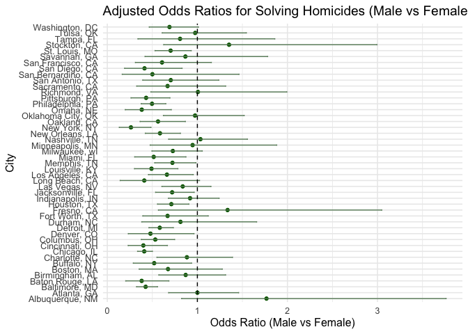
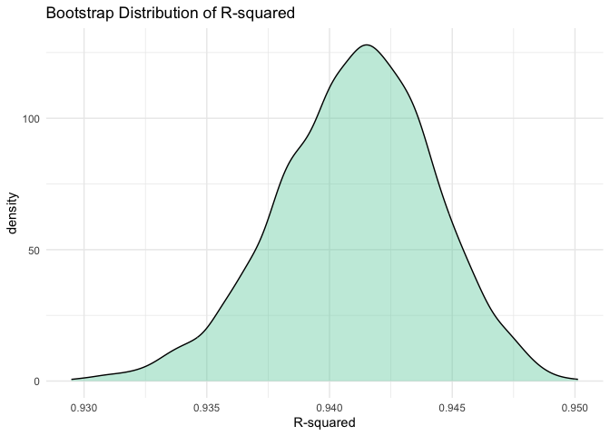
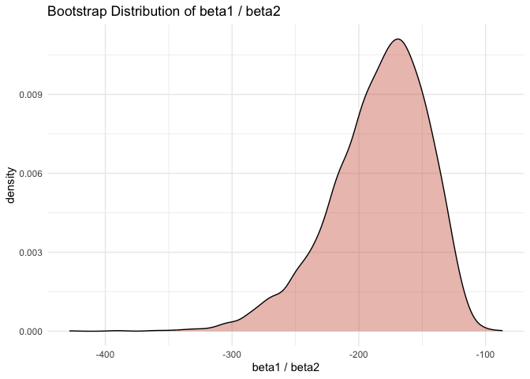
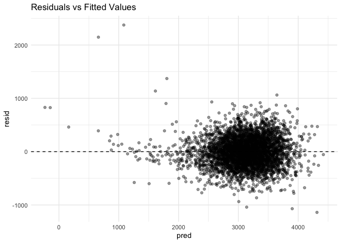
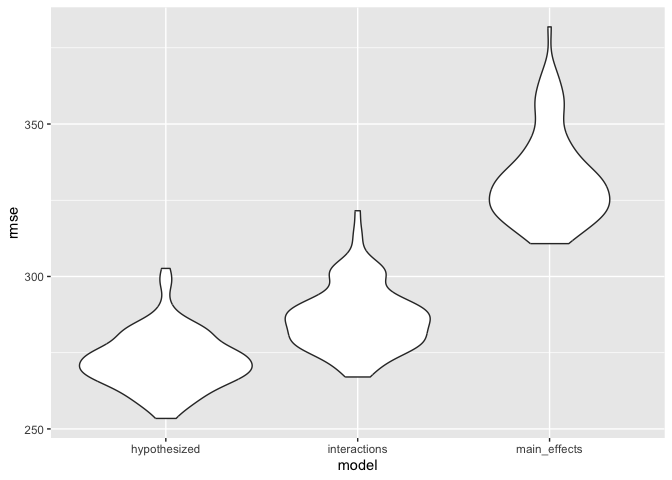

Homework 6
================
Angelica Bailey
2025-11-26

``` r
library(tidyverse)
library(modelr)
library(broom)
```

## Problem 1

Reading in data

``` r
homicide_data = read_csv("data/homicide-data.csv")
```

Data cleaning

``` r
homicide_data = homicide_data |> 
  #creating city_state variable and binary variable for solved/unsolved homicides
  mutate(city_state = str_c(city, ", ", state), 
         homicide_solved = if_else(disposition == "Closed by arrest", 1, 0)    
         ) |> 
  #filtering states and race
  filter(!city_state %in% c("Dallas, TX",
                            "Phoenix, AZ",
                            "Kansas City, MO",
                            "Tulsa, AL"),
         victim_race %in% c("White", "Black")) |> 
  #victim age as numeric
  mutate(victim_age = suppressWarnings(as.numeric(victim_age)))
```

Fitting logistic regression for Baltimore, MD

``` r
baltimore_data = homicide_data |> 
  filter(city_state == "Baltimore, MD")

baltimore_fit = glm(
  homicide_solved ~ victim_age + victim_sex + victim_race,
  data = baltimore_data,
  family = binomial(link = "logit")
)

# tidy model with adjusted odds ratio
tidy_fit = tidy(baltimore_fit, exponentiate = TRUE, conf.int = TRUE)

#extracting OR for victim sex
tidy_fit |> 
  filter(term == "victim_sexMale")
```

    ## # A tibble: 1 × 7
    ##   term           estimate std.error statistic  p.value conf.low conf.high
    ##   <chr>             <dbl>     <dbl>     <dbl>    <dbl>    <dbl>     <dbl>
    ## 1 victim_sexMale    0.426     0.138     -6.18 6.26e-10    0.324     0.558

Iterating for all cities

``` r
city_or_results = homicide_data |> 
  group_by(city_state) |> 
  nest() |> 
  #fitting logistic model for each city
  mutate(
    model = map(data, ~ glm(
      homicide_solved ~ victim_age + victim_sex + victim_race,
      data = .x,
      family = binomial
    )),
    #extracting OR
    results = map(model, ~ tidy(
      .x,
      exponentiate = TRUE,
      conf.int = TRUE
    ))
  ) |> 
  unnest(results) |> 
  filter(term == "victim_sexMale") |> 
  select(city_state, estimate, conf.low, conf.high)
```

Creating plot

``` r
city_or_results = city_or_results |> 
  #reordering cities by OR
  mutate(city_state = fct_reorder(city_state, estimate))

ggplot(city_or_results, 
       aes(x = estimate, 
           y = city_state)) +
  geom_point(color = "darkgreen") +
  geom_errorbarh(aes(xmin = conf.low, xmax = conf.high), color = "darkseagreen4", height = 0.2) +
  geom_vline(xintercept = 1, linetype = "dashed") +
  labs(
    title = "Adjusted Odds Ratios for Solving Homicides (Male vs Female Victims)",
    x = "Odds Ratio (Male vs Female)",
    y = "City"
  ) +
  theme_minimal(base_size = 12)
```

<!-- -->

**Comments:**

The plot shows variation across cities in the adjusted odds ratio. In
most cities, the odds ratios are below 1 indicating that homicides
involving male victims are less likely to be solved than those involving
female victims when adjusting for age and race. A few cities have an
odds ratio closer to or above 1 showing an increase in odds for male
victims. Some estimates have wide confidence intervals signifying
uncertainty in the estimate.

## Problem 2

``` r
library(p8105.datasets)
data("weather_df")
```

Bootstrapping

``` r
bootstrap_results = 
  weather_df |>
  modelr::bootstrap(5000) |>
  mutate(
    model = map(strap, \(df) lm(tmax ~ tmin + prcp, data = df)),
    
    results = map(model, \(fit) {
      coefs = tidy(fit)
      tibble(
        r2 = glance(fit)$r.squared,
        ratio = coefs$estimate[coefs$term == "tmin"] /
          coefs$estimate[coefs$term == "prcp"]
      )
    })
  ) |>
  select(.id, results) |>
  unnest(results)
```

Plotting distribution of estimates

``` r
#plot of r^2
bootstrap_results |>
  ggplot(aes(x = r2)) +
  geom_density(fill = "aquamarine3", alpha = 0.4) +
  theme_minimal() +
  labs(
    title = "Bootstrap Distribution of R-squared",
    x = "R-squared"
  )
```

<!-- -->

**Comments:**

The bootstrap distribution of R<sup>2</sup> is approximately unimodal,
with most of the density concentrated between about 0.935 and 0.945. The
shape is more symmetric and does not have heavy tails, showing that the
estimate of R<sup>2</sup> is stable across bootstrap samples. The
variability across samples is small.

``` r
#plot of beta1/beta2
bootstrap_results |>
  ggplot(aes(x = ratio)) +
  geom_density(fill = "coral3", alpha = 0.4) +
  theme_minimal() +
  labs(
    title = "Bootstrap Distribution of beta1 / beta2",
    x = "beta1 / beta2"
  )
```

<!-- -->

**Comments:**

The bootstrap distribution of $\beta$ <sub>1</sub> **/**$\beta$
<sub>2</sub>is wide and strongly left-skewed. This shows that the ratio
of the `tmin` effect to the `prcp` effect varies across bootstrap
samples. The coefficient for `prcp` is small so variations in $\beta$
<sub>2</sub> can cause the ratio to change greatly.

Computing 95% confidence intervals

``` r
bootstrap_results |>
  pivot_longer(cols = c(r2, ratio), names_to = "term", values_to = "estimate") |>
  group_by(term) |>
  summarize(
    ci_lower = quantile(estimate, 0.025),
    ci_upper = quantile(estimate, 0.975)
  )
```

    ## # A tibble: 2 × 3
    ##   term  ci_lower ci_upper
    ##   <chr>    <dbl>    <dbl>
    ## 1 r2       0.934    0.947
    ## 2 ratio -274.    -125.

## Problem 3

``` r
bwt_data = read_csv("data/birthweight.csv")
```

Cleaning data

``` r
bwt_data = bwt_data |>
  mutate(
    babysex = factor(babysex, labels = c("male", "female")),
    malform = factor(malform, labels = c("absent", "present")),
    frace = factor(frace,
                   labels = c("White", "Black", "Asian", "Puerto Rican", 
                              "Other")),
    mrace = factor(mrace,
                   labels = c("White", "Black", "Asian", "Puerto Rican")),
  ) |>
  drop_na()
```

Regression Model:

I’m starting a model based on hypothesized structure for the factors
that underly birthweight. I’m including potential biological predictors
to model birthweight.

``` r
initial_model = 
  lm(bwt ~ bhead + blength + gaweeks + wtgain + smoken +
    momage + mheight + fincome + mrace,
  data = bwt_data
)
summary(initial_model)
```

    ## 
    ## Call:
    ## lm(formula = bwt ~ bhead + blength + gaweeks + wtgain + smoken + 
    ##     momage + mheight + fincome + mrace, data = bwt_data)
    ## 
    ## Residuals:
    ##      Min       1Q   Median       3Q      Max 
    ## -1139.13  -183.50    -3.55   176.04  2374.81 
    ## 
    ## Coefficients:
    ##                     Estimate Std. Error t value Pr(>|t|)    
    ## (Intercept)       -6246.1778   134.4235 -46.466  < 2e-16 ***
    ## bhead               130.5416     3.4181  38.191  < 2e-16 ***
    ## blength              75.5021     2.0272  37.245  < 2e-16 ***
    ## gaweeks              11.7859     1.4612   8.066 9.35e-16 ***
    ## wtgain                3.8413     0.3930   9.775  < 2e-16 ***
    ## smoken               -4.7797     0.5878  -8.131 5.50e-16 ***
    ## momage                1.4238     1.1930   1.193   0.2328    
    ## mheight              11.1136     1.6444   6.759 1.58e-11 ***
    ## fincome               0.2627     0.1797   1.462   0.1439    
    ## mraceBlack         -131.7778    10.1969 -12.923  < 2e-16 ***
    ## mraceAsian         -106.5559    42.7117  -2.495   0.0126 *  
    ## mracePuerto Rican   -95.4558    19.4503  -4.908 9.56e-07 ***
    ## ---
    ## Signif. codes:  0 '***' 0.001 '**' 0.01 '*' 0.05 '.' 0.1 ' ' 1
    ## 
    ## Residual standard error: 274 on 4330 degrees of freedom
    ## Multiple R-squared:  0.7145, Adjusted R-squared:  0.7138 
    ## F-statistic: 985.3 on 11 and 4330 DF,  p-value: < 2.2e-16

Adding predictions and residuals

``` r
bwt_data = bwt_data |>
  add_predictions(initial_model) |>
  add_residuals(initial_model)
```

Plotting residuals vs. fitted

``` r
bwt_data |>
  ggplot(aes(x = pred, y = resid)) +
  geom_point(alpha = 0.4) +
  geom_hline(yintercept = 0, linetype = "dashed") +
  theme_minimal() +
  labs(
    title = "Residuals vs Fitted Values"
  )
```

<!-- -->

**Comments:** The residuals vs fitted values plot shows that residuals
are centered around zero across the range of fitted birthweights. The
spread of residuals increases as the fitted values increase, indicating
heteroscedasticity. Higher birthweights tend to have larger residual
variance. There are also several outliers, where the model’s predictions
are far from the observed birthweights.

Comparing models with cross validation

``` r
#creating train/test splits
cv_df =
  crossv_mc(bwt_data, 100, test = 0.2) |>
  mutate(
    train = map(train, as_tibble),
    test  = map(test,  as_tibble)
  )

#fitting models and computing rmse
cv_df =
  cv_df |>
  mutate(
    hypothesized_mod = map(train, \(df)
      lm(bwt ~ bhead + blength + gaweeks + wtgain + smoken +
         momage + mheight + fincome + mrace, data = df)),
    main_effects_mod = map(train, \(df)
      lm(bwt ~ blength + gaweeks, data = df)),
    interactions_mod = map(train, \(df)
      lm(bwt ~ bhead * blength * babysex, data = df))
  ) |> 
  mutate(
    rmse_hypothesized = map2_dbl(hypothesized_mod, test, \(mod, df) rmse(model = mod, data = df)),
    rmse_main_effects = map2_dbl(main_effects_mod, test, \(mod, df) rmse(model = mod, data = df)),
    rmse_interactions = map2_dbl(interactions_mod, test, \(mod, df) rmse(model = mod, data = df))
  )
```

Plotting distributions of RMSE

``` r
cv_df |>
  select(rmse_hypothesized, rmse_main_effects, rmse_interactions) |>
  pivot_longer(everything(),
               names_to = "model",
               values_to = "rmse",
               names_prefix = "rmse_") |>
  ggplot(aes(x = model, y = rmse)) + geom_violin()
```

<!-- -->

**Comments:** The initial hypothesized model seems to perform the best
with the lowest RMSE while the model with main effects only has the
highest RMSE showing underfitting. The hypothesized model seems the most
fitting to balance predictive accuracy and model complexity.
